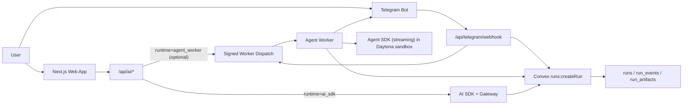

# Technical Overview

Last updated: 2026-02-19

## 1) System Purpose
Laniameda AI UGC is an image-first workflow app with dual AI runtimes:
- `ai_sdk` for short web/dashboard jobs
- `agent_worker` for Telegram-heavy and sandboxed runs

Convex is the source of truth for run lifecycle and artifacts.

## 2) Runtime Topology (Current)

## 3) Implemented Execution Paths
### 3.1 Web path (`ai_sdk`)
1. UI calls `/api/ai/runs/stream` or `/api/ai/images/generate`.
2. API creates/updates run records in Convex.
3. AI SDK executes and streams partials.
4. Convex stores terminal status and artifacts.

### 3.2 Telegram path (`agent_worker`, streaming-first)
1. Telegram sends update to `/api/telegram/webhook`.
2. Webhook verifies secret, enforces body size and body-read timeout.
3. Update is normalized to stable inbound envelope.
4. Run is created in Convex with `source=telegram`, `runtime=agent_worker` and source metadata (`sourceChatId`, `sourceThreadId`, `sourceMessageId`, `sourceUpdateId`).
5. Worker dispatch is signed and sent to `agent-worker`.
6. Worker claims run, creates Daytona sandbox, stages media to `media/inbound/...`.
7. Agent SDK runs in streaming mode inside Daytona.
8. Events stream to Convex; terminal artifact persists.
9. Worker replies back to Telegram thread/chat with final result.

## 4) OpenClaw Pattern Adoption Status
- Adopted:
  - webhook hardening (secret + size + timeout)
  - dedupe fallback (`update_id` primary, `chatId:messageId` fallback)
  - media retry classifier/backoff with non-retryable oversize handling
  - thread routing guard for general topic behavior
- Deferred:
  - sticker cache
  - advanced voice-send fallback
  - local media-serving endpoint pattern

## 5) Code Map (Current Ownership)
- `app/api/telegram/webhook/route.ts`: Telegram ingress hardening + run creation + dispatch
- `lib/telegram/inbound.ts`: Telegram normalization + idempotency key strategy
- `agent-worker/orchestrator.ts`: run orchestration, media staging, runtime selection, finalize/reply
- `agent-worker/agent-runtime.ts`: Agent SDK single/streaming execution adapters
- `agent-worker/daytona-spawn.ts`: spawn bridge for running Agent SDK process in Daytona sessions
- `agent-worker/streaming-message-builder.ts`: Telegram envelope/media -> Agent SDK streaming message blocks
- `agent-worker/telegram.ts`: media staging, retry classifier, thread routing, Telegram send
- `convex/schema.ts`: run schema + source metadata fields
- `convex/runs.ts`: lifecycle mutations/queries and event ledger
- `tests/telegram-streaming-integration.test.ts`: webhook -> dispatch -> worker -> streaming integration harness

## 6) Current Alignment Assessment
Legend: `Aligned` = implemented and working, `Partial` = scaffolded but not yet full product behavior, `Gap` = not implemented.

| Area | Status | Notes |
|---|---|---|
| Telegram inbound -> backend connection | Aligned | Webhook + normalization + Convex run creation + dispatch in place |
| Agent SDK worker -> Telegram connection | Aligned | Worker sends terminal replies using routing metadata |
| Streaming-first Agent SDK in Daytona | Aligned | Telegram runs use streaming path first; single-mode fallback flag exists |
| Convex run ledger observability | Aligned | `runs`, `run_events`, `run_artifacts` actively used |
| OpenClaw reliability subset | Aligned | Hardening/dedupe/retry/thread routing implemented |
| Image/PDF direct multimodal blocks | Aligned | Direct blocks in streaming message composer |
| Audio/video/voice deep semantic extraction | Partial | Staged and instruction-passed; full extraction pipeline not yet implemented |
| Agent persistence into library tables | Partial | Prompt-package output now materializes into `prompts`; full multi-entity tool-calling flow (assets/tags/folders) still pending |
| Dedicated Telegram gateway service | Partial | Ingress runs in Next.js route for MVP; separate service deferred |
| Dashboard UX consuming run ledger in realtime work panel | Partial | Backend contract is ready; full UX integration remains |

## 7) Quality Baseline (Current)
- `bun run lint`: pass
- `bun test`: pass (37 tests)
- `bunx tsc --noEmit`: pass

## 8) Refactor State
- Completed:
  - orchestrator decomposed into focused helpers (media prep, runtime execution, finalization)
  - shared run phase constants centralized in `lib/run-phases.ts`
  - runtime loop deduplicated in `agent-runtime.ts`
- Remaining high-value refactors:
  - avoid uploading Agent SDK package to sandbox on every run (cache or image bake)
  - strengthen Daytona spawned-process kill/cancel semantics
  - move integration-harness utilities into reusable `tests/helpers/*`

## 9) Next Technical Focus
1. Implement agent tool-calling path that writes extracted prompt/media metadata into Convex domain tables (`prompts`, `assets`, tags/folders).
2. Add worker HTTP-level integration tests for signed `/v1/runs/dispatch` and `/v1/runs/:id/cancel`.
3. Optimize sandbox startup latency (SDK sync caching + cold-start reduction).
4. Expand multimodal handling for audio/video/voice beyond staged references.

## 10) Related Docs
- Product PRD: `agent-docs/PRD.md`
- Backend PRD: `agent-docs/BACKEND_PRD.md`
- AI runtime policy: `agent-docs/AI_RUNTIME.md`
- Telegram contract/spec: `agent-docs/TELEGRAM_AGENT_ENGINEERING_PRD.md`
- Telegram diagrams: `agent-docs/TELEGRAM_AGENT_DIAGRAMS.md`
