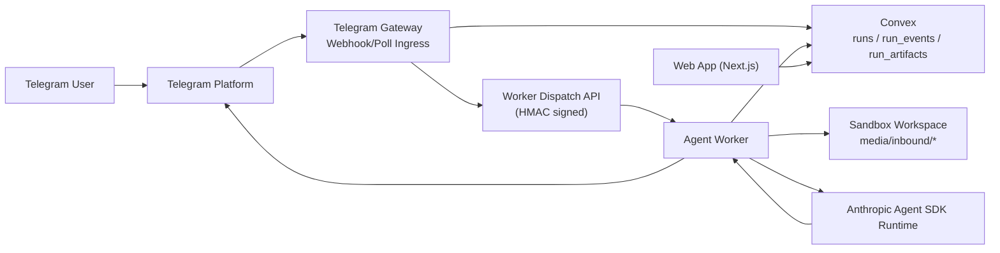
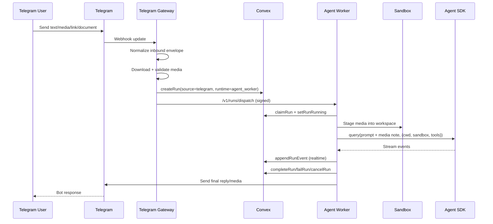
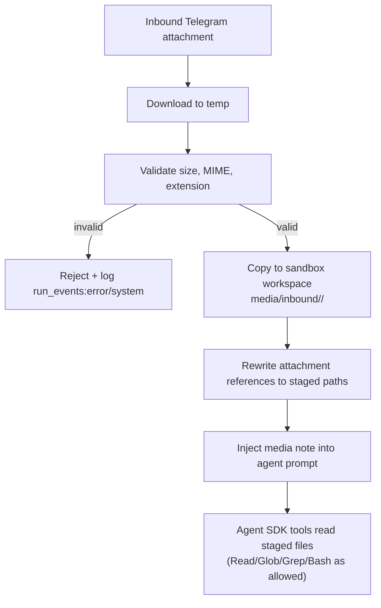
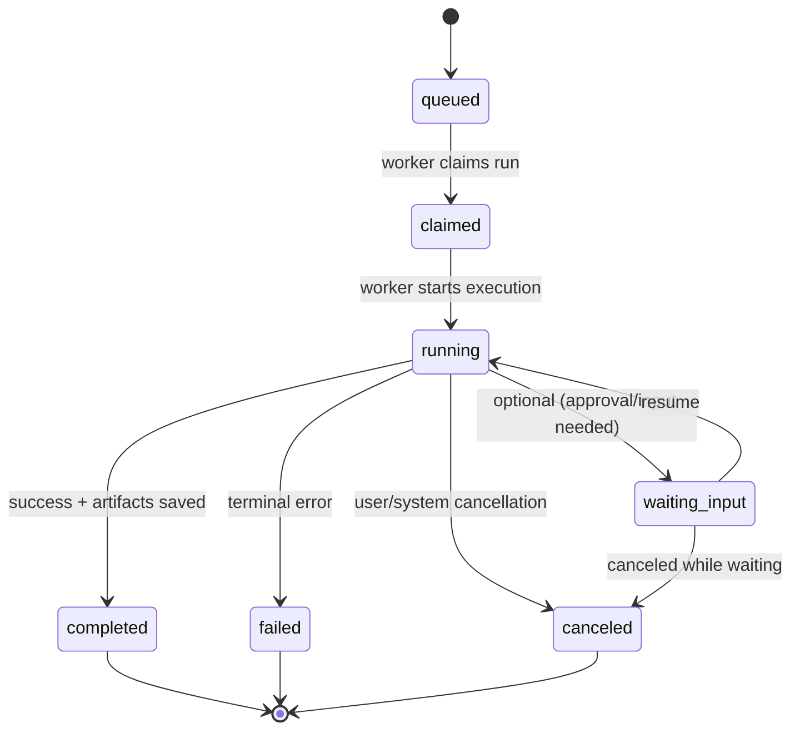
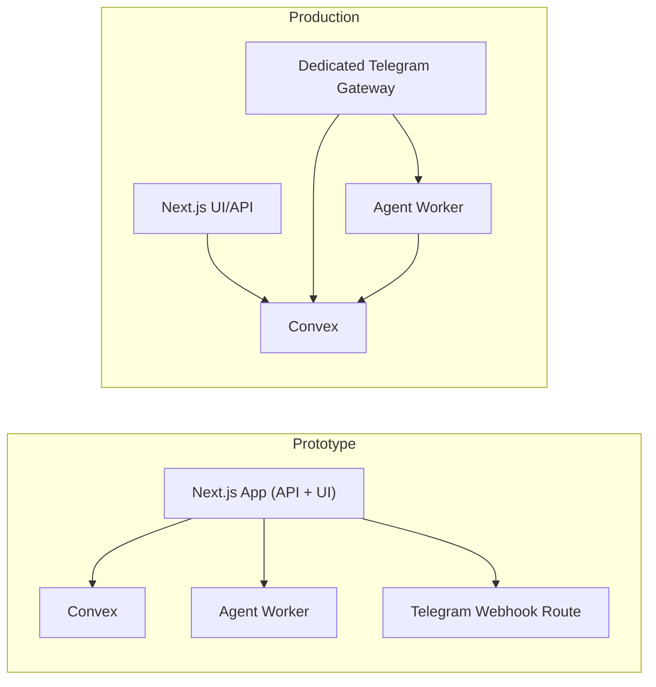
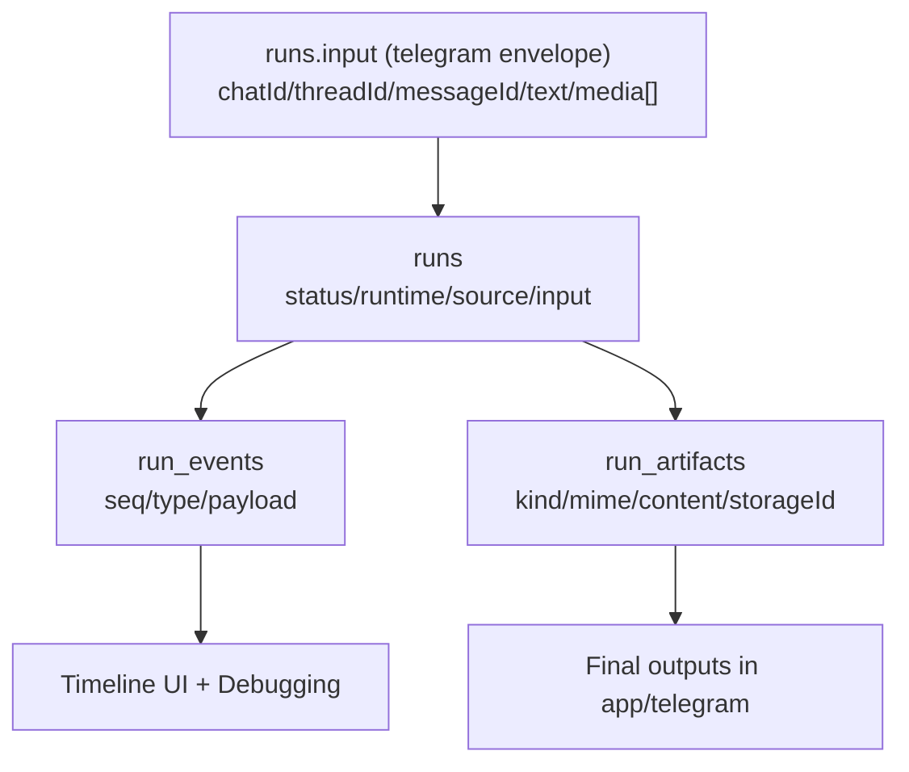

# Telegram Agent Integration — Diagrams

Last updated: 2026-02-16

Purpose: editable Mermaid diagrams that explain runtime flow and system structure for product and engineering planning.

## 1) System Structure (Logical Components)

## 2) End-to-End Telegram Message Flow

## 3) Media Staging and Access Flow

## 4) Run Lifecycle State Machine

## 5) Deployment Topology (Prototype vs Production)

## 6) Data Contract Map (Run-Centric)

## 7) Editing Guidance
- Keep diagram nodes aligned with real code boundaries in:
  - `agent-worker/*`
  - `app/api/ai/*`
  - `convex/runs.ts`
- Update diagrams whenever run contracts/statuses or transport boundaries change.
- Prefer editing these Mermaid sources over static image exports.
