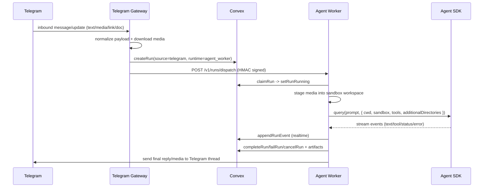

# Telegram + Agents SDK Integration — Engineering PRD

Last updated: 2026-02-19

## 1) Objective
Implement a working Telegram-to-Agent pipeline on top of the Laniameda AI UGC backend with:
- Agent SDK execution in sandbox;
- attachment staging into sandbox workspace;
- real-time run/event persistence in Convex;
- bidirectional Telegram communication (ingress + reply);
- coexistence with existing AI SDK runtime for non-heavy paths.

## 1.1) Current Implementation Status
- Implemented:
  - Telegram webhook ingress in Next.js route with secret/body/timeout hardening.
  - Telegram envelope normalization and idempotency fallback keys.
  - Convex run creation with `source=telegram`, `runtime=agent_worker`, and source metadata fields.
  - Signed worker dispatch, sandbox creation, staged media paths, and terminal Telegram replies.
  - Agent SDK streaming-first runtime executed in Daytona sandbox.
- Partial:
  - direct multimodal streaming blocks are first-class for image/PDF.
  - audio/video/voice are staged and passed as tool-readable references, but deeper extraction is not yet implemented.
- Not implemented:
  - agent tool-calls that persist extracted prompt/media/tag outputs into Convex domain tables (`prompts`, `assets`, folder/tag joins).

## 2) Non-Goals
- Replace existing AI SDK routes.
- Introduce video-generation product workflows.
- Build full command framework for Telegram bot.

## 3) Current Assets Reused
Existing run/event infrastructure:
- `convex/schema.ts` (`runs`, `run_events`, `run_artifacts`)
- `convex/runs.ts` (run lifecycle APIs)
- `lib/run-contract.ts` (`source: "telegram"`, `runtime: "agent_worker"`)

Existing worker path:
- `agent-worker/server.ts`
- `agent-worker/orchestrator.ts`
- `agent-worker/agent-runtime.ts`
- `lib/ai/worker-dispatch.ts` (signed dispatch/cancel)

Existing runtime split:
- `app/api/ai/runs/stream/route.ts` (`ai_sdk` and optional `agent_worker`)
- `agent-docs/AI_RUNTIME.md`

## 4) Architecture
### 4.1 Components
1. **Telegram Gateway (new)**
   - Receives Telegram webhooks/poll updates.
   - Normalizes inbound message and attachments.
   - Creates run in Convex (`source=telegram`, `runtime=agent_worker`).
   - Dispatches run to worker (existing HMAC path).

2. **Agent Worker (existing, expanded)**
   - Claims run.
   - Creates sandbox (already implemented).
   - Stages media into workspace (new).
   - Runs Agent SDK with sandbox + workspace binding.
   - Streams events to Convex (already implemented).

3. **Convex (existing)**
   - Source of truth for run status/events/artifacts.
   - Real-time subscription source for dashboard.

4. **Telegram Reply Sender (implemented)**
   - Sends final/partial outputs back to Telegram.
   - Maps run to chat/thread target.

### 4.2 End-to-End Sequence


## 5) Inbound Normalization Contract
Create a Telegram envelope before run creation. Proposed payload shape:

```ts
type TelegramInboundEnvelope = {
  provider: "telegram";
  accountId?: string;
  chatId: string;
  threadId?: string | number;
  messageId: string;
  fromUserId?: string;
  fromUsername?: string;
  fromDisplayName?: string;
  chatType: "direct" | "group" | "supergroup" | "channel";
  text?: string;
  links?: string[];
  media?: Array<{
    mediaId: string;
    kind: "image" | "video" | "audio" | "voice" | "document";
    mimeType?: string;
    fileName?: string;
    sizeBytes?: number;
    localPath?: string; // temporary pre-stage path
  }>;
  receivedAt: number;
};
```

Storage location:
- Persist this envelope under `runs.input` for `source: "telegram"`.
- Include minimal routing fields in `run_events` for observability.

## 6) Media Staging Design (Must-Have)
### 6.1 Rationale
Agent SDK sandbox tool calls should only read files that are inside the run workspace. Telegram host temp paths must never be used directly in final prompt/tool context.

### 6.2 Staging Rules
1. Download inbound media to temporary location.
2. Validate:
   - max size,
   - MIME allowlist,
   - file extension normalization.
3. Copy into run workspace (example):
   - `<workspace>/media/inbound/<messageId>/<safeFilename>`
4. Rewrite media references to staged relative paths.
5. Add deterministic media note to prompt context, for example:
   - `[media attached: media/inbound/123/photo-1.jpg (image/jpeg)]`

### 6.3 Security Rules
- Reject path traversal.
- Reject absolute path injection from inbound payloads.
- Do not mount arbitrary host directories.
- Log blocked files as `run_events` type `system`.

## 7) Agent SDK Execution Contract
Current runtime call:
- `agent-worker/agent-runtime.ts` uses `query({ prompt, options })`.

Required expansion:
1. Pass workspace-bound `cwd`.
2. Pass `additionalDirectories` only if needed for staged path scope.
3. Keep `sandbox.enabled=true`.
4. Keep explicit `allowedTools`.
5. Use run-specific prompt that includes normalized text + media notes.

Example intent:
```ts
query({
  prompt: promptWithMediaContext,
  options: {
    model: workerConfig.claudeModel,
    cwd: runWorkspaceDir,
    additionalDirectories: [path.join(runWorkspaceDir, "media", "inbound")],
    allowedTools: workerConfig.allowedTools,
    sandbox: { enabled: true, allowUnsandboxedCommands: false },
    includePartialMessages: true,
    maxTurns: workerConfig.maxTurns,
  },
});
```

## 8) Telegram Reply Routing Contract
Store per-run reply target metadata in `runs.input`:
- `chatId`
- `threadId`
- `replyToMessageId` (optional)
- `accountId` (if multi-bot)

Worker sends final result to Telegram using this metadata.

Failure behavior:
- if Telegram send fails, keep run terminal state in Convex and append `error` event with transport details.

## 9) Convex Contract Updates
Implemented:
1. Optional typed source metadata fields in `runs`:
   - `sourceChatId`, `sourceThreadId`, `sourceMessageId`, `sourceUpdateId`.
2. Stable event taxonomy:
   - `stream_text`, `tool_call`, `tool_result`, `status_change`, `system`, `error`.

## 10) Service Boundary Decision
Do we need a separate Node.js server?

Recommendation:
1. **Prototype:** can use existing app process for Telegram webhook ingress.
2. **Production:** run dedicated Telegram gateway service.

Reason:
- webhook retry behavior and burst isolation;
- simpler bot token/secrets management;
- cleaner scale profile than coupling to web frontend server.

## 11) Phased Implementation Plan
### Phase 1: Telegram Ingress + Run Creation
- Implemented.

### Phase 2: Media Staging + Agent Execution
- Implemented for streaming-first runtime path in Daytona.

### Phase 3: Reply Delivery + Realtime UX
- Terminal reply delivery is implemented.
- Dashboard realtime UX integration remains in progress.

### Phase 4: Hardening
- Implemented:
  - idempotency by Telegram update/message fallback keys,
  - media retrieval retry classification/backoff,
  - thread/topic routing guard behavior.
- Remaining:
  - operational metrics/alerts and dead-letter policy.

## 12) Testing Strategy
### Unit
- envelope normalization
- media validation and safe-path rewrite
- prompt media-note composition
- idempotency key generation for Telegram updates

### Integration
- webhook -> run create -> worker dispatch
- staged media is readable by Agent SDK tools
- run events stream into Convex during execution
- final reply reaches Telegram thread

### Failure Cases
- malformed webhook payload
- oversized/blocked media
- worker unavailable
- Agent SDK timeout
- Telegram reply API failure

## 13) Acceptance Criteria
1. Telegram text-only message triggers a run and returns reply.
2. Telegram media message triggers a run and staged file is readable by agent.
3. Run lifecycle appears in Convex with real-time events.
4. Final run artifact and terminal status persist reliably.
5. AI SDK path remains functional for dashboard `ai_sdk` requests.

## 14) OpenClaw-Informed Implementation Notes
Borrow these patterns directly:
1. Webhook hardening (`openclaw/src/telegram/webhook.ts`):
   - require non-empty webhook secret;
   - enforce body size/time limits;
   - use timeout-safe callback behavior to avoid retry storms.
2. Update dedupe (`openclaw/src/telegram/bot-updates.ts`):
   - use `update_id` primary dedupe key;
   - fallback keys for callback/message updates.
3. Media retrieval resilience (`openclaw/src/telegram/bot/delivery.ts` `resolveMedia`):
   - retry `getFile` with backoff;
   - treat oversized files as non-retryable;
   - in our MVP policy, fail run when required staging fails.
4. Thread/topic routing (`openclaw/src/telegram/bot/helpers.ts`):
   - explicit DM vs group vs forum-topic thread handling;
   - avoid invalid thread param usage for Telegram general topic.
5. Keep our contract boundaries:
   - normalize inbound payload to run envelope;
   - stage files into worker workspace;
   - persist run lifecycle in Convex;
   - return terminal status deterministically.

## 15) Risks and Mitigations
1. **Risk:** sandbox exists but workspace not wired to agent runtime.
   - Mitigation: enforce `cwd` + staged path contract in runtime code review checklist.
2. **Risk:** Telegram file types vary and may break parsing.
   - Mitigation: strict validator with fallback behavior and clear user-facing error.
3. **Risk:** duplicate updates/retries create duplicate runs.
   - Mitigation: idempotency keys on Telegram update IDs.
4. **Risk:** silent reply delivery failures.
   - Mitigation: explicit send-result events and retry policy.

## 16) Linked Docs
- Product foundation PRD: `agent-docs/PRD.md`
- Editable diagrams: `agent-docs/TELEGRAM_AGENT_DIAGRAMS.md`
- Runtime overview: `agent-docs/AI_RUNTIME.md`
- Backend runtime baseline: `agent-docs/BACKEND_PRD.md`
- Worker deployment: `agent-docs/DEPLOYMENT_AGENT_WORKER.md`
